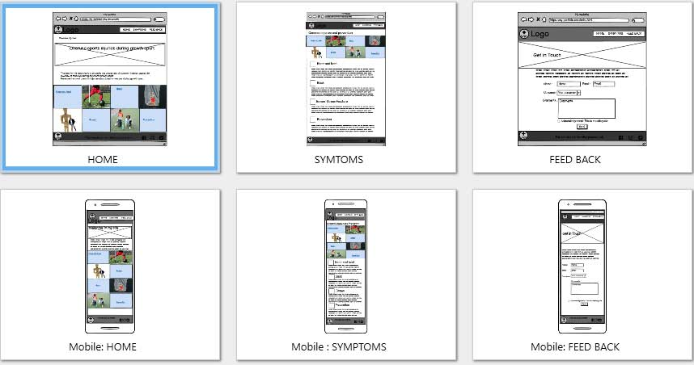

# Preventing overuse injuries during growth spurt

This site is created to promote awareness of common injuries among children and young adults caused by overuse of muscles during their growth spurt and suggest prevention measures that they can take in order to avoid long term health effect.

## UX
The aim for this site is to provide information and knowledge for parents, trainers, teachers and young athletes themselves about the harm of doing too much high impact sport trainings while they are still growing so that they can takes all the measures to prevent any unnecessary injuries.
This site only summarises common injuries and rough ideas for prevention.
There is much more detailed information available on the web and my aim here is to get people interested in the topic and get them aware of the common problems.

The web site's goal is to provide summery of the topic by giving a user an opportunity to glace the information easily.
Provided on the index page are summary of the issues raised here and links for common injury list also navigation bar provide contact page for any users who wishes to share their concern or stories.

## Features

This web site is created using HTML5 and CSS3.

Footer with disclaimer that disappear when screen size is smaller to avoid too much information in the footer area.

Wireframe:

## Existing Features
* Nav bar which transforms to a humberger menu for smaller devices
* Landing page that summarises the purpose of this web site and summary information 
* Some of common injuries with associated image beside it
* Feed back page – for who are interested to get in touch and share their stories

## Features Left to Implement

Need to complete here! ! !

## Technologies Used 
Html5 and CSS3 including CSS grid and Bootstrap feature

## Testing
I have tested this web site with W3C HTML Validator for all HTML and CSS files.
I also tested all the pages display properly in different device sizes using Crome Developper tool and actual devices such as mobile phone and ipad.

