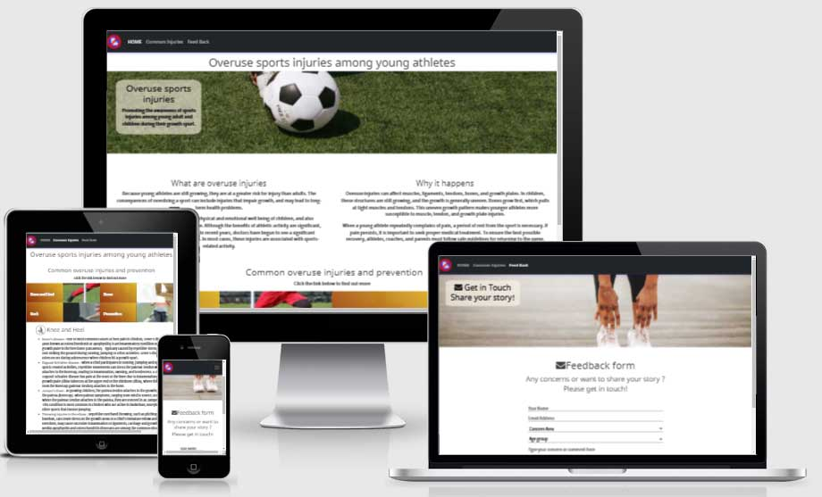
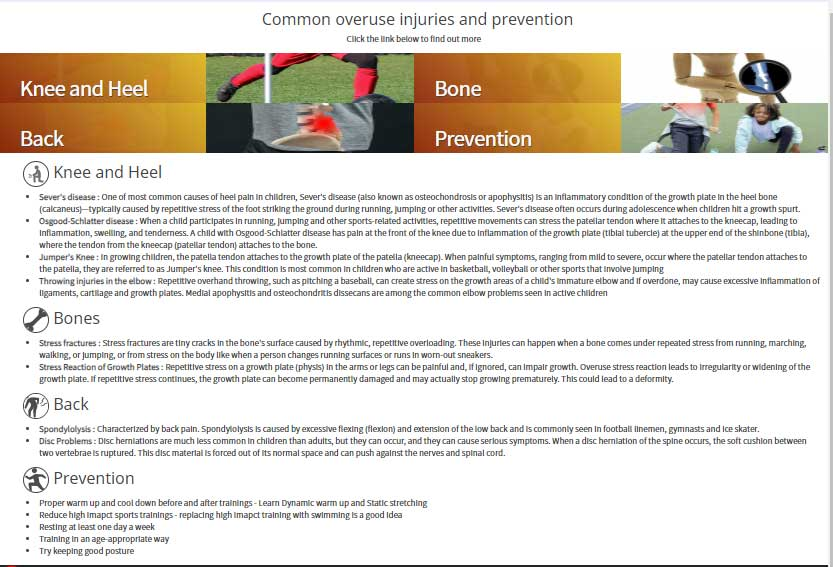
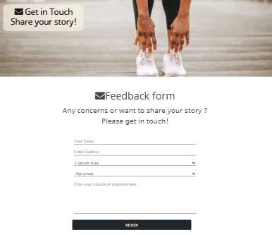

# Preventing overuse injuries during growth spurt

This site is created to promote awareness of common injuries among children and young adults caused by overuse of muscles during their growth spurt and suggest prevention measures that they can take in order to avoid long term health effect.

The aim for the site is to provide the general information and knowledge for parents, trainers, teachers and young athletes themselves about the harm of doing too much high impact sport trainings while they are still growing so that they can takes all the measures to prevent any unnecessary injuries.
This site only summarises the tpic, common injuries and rough ideas for prevention.
There is much more detailed information widely available on the web and this site's aim here is to get people aware of the topicof this common problems.

## Features

This web site is created using HTML5 and CSS3, and some bootstrap features include JavaScript.

### Existing Features

* Navigation Bar
  
   

  * The full responsive navigation bar includes links to the Logo, Home, Common Injries and Feedback page and is identical in each page to allow for easy navigation.

  * This navigation bar that transforms as a humberger menu for smaller devices.

* Footer

  

  * Footer has a same color scheme as a navigation bar to keep the web site consistency.
  
  * It also provides Logo that is linked to the landing page and socail madia links which will open in a new window.

  * It also has a disclailer line that disappears with the screen size is smaller to avoid conggestion.

* Landing Page

  

  * This page summarises the topic and the purpose of this web site 
  
  * The landing page has a titile followed by Hero image with title inside on the top of the page.
  
  * Summary of the topic follows the Hero image 
  to explain what is web site is about.
  
  * This page also provides large buttons with related photos beside them that links each section in common injury page.

* Common injuries Page

  
  
  * Top of the page has the links to each injuries section in the page. Each link has a associated image beside it to match the landing page to have consistency but the shorter height to give more space to the paragraph below.

* Feedback page
  

  * This page is made for a user who wishes to contact us to express their opinion or share their stories.
The page is made it simple so that a user doesn't get hesitation making a contact.

  *  By the feedback from the mentor, this feedback page design was changed to a minimal looks for easier and clearer entry.

## Features Left to Implement

Initial design as Wireframe:

The initial design for the web site was to have the large link button and associated images in altenetive display in other rows, however the implementaion was yet to made.

## Technologies Used 
Html5 and CSS3 including CSS grid and Bootstrap feature

## Validator Testing

  * No errors were returned when passing through the official [W3C validator]("https://validator.w3.org/")

  * No errors were found when passing through the official [(Jigsaw) validator]("https://jigsaw.w3.org/css-validator/")

Test was carried out on different device sizes using Crome Developper tool and actual devices such as mobile phone and ipad.

## Unfixed Bugs

---------NEED TO FILL OUT------------

## Deployment

Following steps were taken to deploy the web site.
1. Log in to GitHub and naviagte to  ms1_overuse_injuries repository.
2. Go to Page section in setting and change dropdown menu from source to master 
3. Open the published page that is diplayed in the page which is __[here](https://mwmlln.github.io/ms1_overuse_injuries/)__

## Credit

The information provided in this site is taken from various sites and books I have used over the years also the web sites below:

* Website contents

  * https://www.bouldercentre.com/news/risk-injury-young-athletes
  *	https://www.childrenshospital.org/conditions-and-treatments/conditions/o/overuse-injuries
  *	https://shorelineortho.com/specialties/sports_medicine-overuse_injuries_in_children.php
  *	https://orthoinfo.aaos.org/en/diseases--conditions/overuse-injuries-in-children/
  *	https://www.thephysiocompany.com/blog/dynamic-warm-up-and-warm-down

* CSS code 
  Some of the CSS code was copied or 
  * https://cssgradient.io/
  * http://techacademy.jp

 

* Media 

  * The photos used in this site were obtained from pexels.com and ac-illust.com
  * Icons used in the pages were taken from Font Awesome, icooon-mono.com and ac-illust.com.

 

