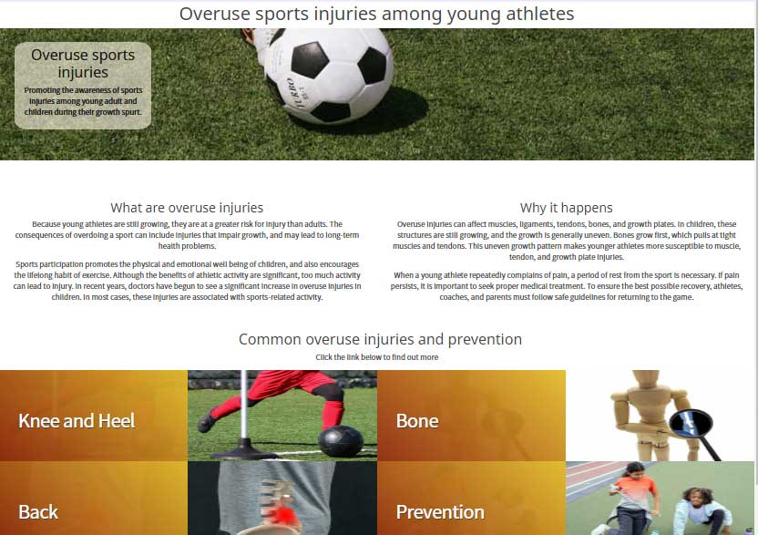

# Preventing overuse injuries during growth spurt

This site is created to promote awareness of common injuries among children and young adults caused by overuse of muscles during their growth spurt and suggest prevention measures that they can take in order to avoid long term health effect.

The aim for the site is to provide the general information and knowledge for parents, trainers, teachers and young athletes themselves about the harm of doing too much high impact sport trainings while they are still growing so that they can takes all the measures to prevent any unnecessary injuries.
This site only summarises the tpic, common injuries and rough ideas for prevention.
There is much more detailed information widely available on the web and this site's aim here is to get people aware of the topicof this common problems.

## Features

This web site is created using HTML5 and CSS3, and some bootstrap features include JavaScript.

### Existing Features

* Navigation Bar

  * The full responsive navigation bar includes links to the Logo, Home, Common Injries and Feedback page and is identical in each page to allow for easy navigation.

  * This navigation bar helps a user to understand which page they're looking at and easily navigate within the site. 

* Footer

  * Footer has a same color scheme as a navigation bar to keep the web site consistency.
  
  * It also provides Logo that is linked to the landing page and socail madia links which will open in a new window.

  * It also has a discla

* Landing Page

  

  * The landing page has a titile followed by Hero iamge with message inside on the top of the page.
  
  * Summary of the topic follows the Hero image 
  to explain what is web site is about.
  
  * This page also provides large buttons with related photos beside them that links each section in common injury page.

Landing page has a large hero image with a message inside

 

* 

* This page summarises the topic and the purpose of this web site 

* Also incluided are the links to common injuries in different part of the body. Each link has a associated image beside it so a user can easily find desired link.

Website Pages

The web site include Navigation bar that minimizes as a humberger menu, footer with disclaimer that disappears when screen size is smaller to avoid congestion in the footer area.

Initial design as Wireframe:

## Existing Features
* Nav bar which transforms to a humberger menu on smaller devices

* List of common injuries with associated image beside it
* Feed back page – for who are interested to get in touch and share their stories - to be used for user stories section in the future

## Commin Injuries page

This page has a same images and links for consistant appearance but shorter to leave more space for list of injuries. 
I also include a icon for every lint title for visual recognition.

## Feedback page

This page is made for a user who wishes to contact us to express their opinion or share their stories.
The page is made it simple so that a user doesn't get hesitation making a contact.

## Features Left to Implement

In the wireframe, the common injuries category links and images are lined in alternative in rows. More list of links and alternive order display is left to implement for the future.

## Technologies Used 
Html5 and CSS3 including CSS grid and Bootstrap feature

## Testing
I have tested this web site with W3C HTML Validator for all HTML and CSS files.
I also tested all the pages display properly in different device sizes using Crome Developper tool and actual devices such as mobile phone and ipad.

I had few issues making the site respponsive for smaller screen and get the layout presentable, especially category links with associated photos beside it to display properly.

Validator Testing - each pages has been tested
* HTML
  * No errors were returned when passing through the official W3C validator
* CSS
  * No errors were found when passing through the official (Jigsaw) validator except warning for root variable setting 

## Deployment

Following steps were taken to deploy the web site.
1. Log in to GitHub and open ms1_overuse_injuries repository.
2. Go to Page section in setting and change source to master 
3. Open the published page that is diplayed in the page which is **[here](https://mwmlln.github.io/ms1_overuse_injuries/)**

## Credit

The information provided in this site is taken from various sites and books I have used over the years also the web sites below:

Website contents

* https://www.bouldercentre.com/news/risk-injury-young-athletes
*	https://www.childrenshospital.org/conditions-and-treatments/conditions/o/overuse-injuries
*	https://shorelineortho.com/specialties/sports_medicine-overuse_injuries_in_children.php
*	https://orthoinfo.aaos.org/en/diseases--conditions/overuse-injuries-in-children/
*	https://www.thephysiocompany.com/blog/dynamic-warm-up-and-warm-down

CSS code 
 Some of the CSS code was copied or 
* https://cssgradient.io/
* https://www.youtube.com/watch?v=68O6eOGAGqA responsive css grid
* techacademy.jp

The icons used in the pages were taken from Font Awesome, icooon-mono.com and  ac-illust.com.

Media 

The photos used in this site were obtained from pexels.com and ac-illust.com

# Acknowledgements

 

